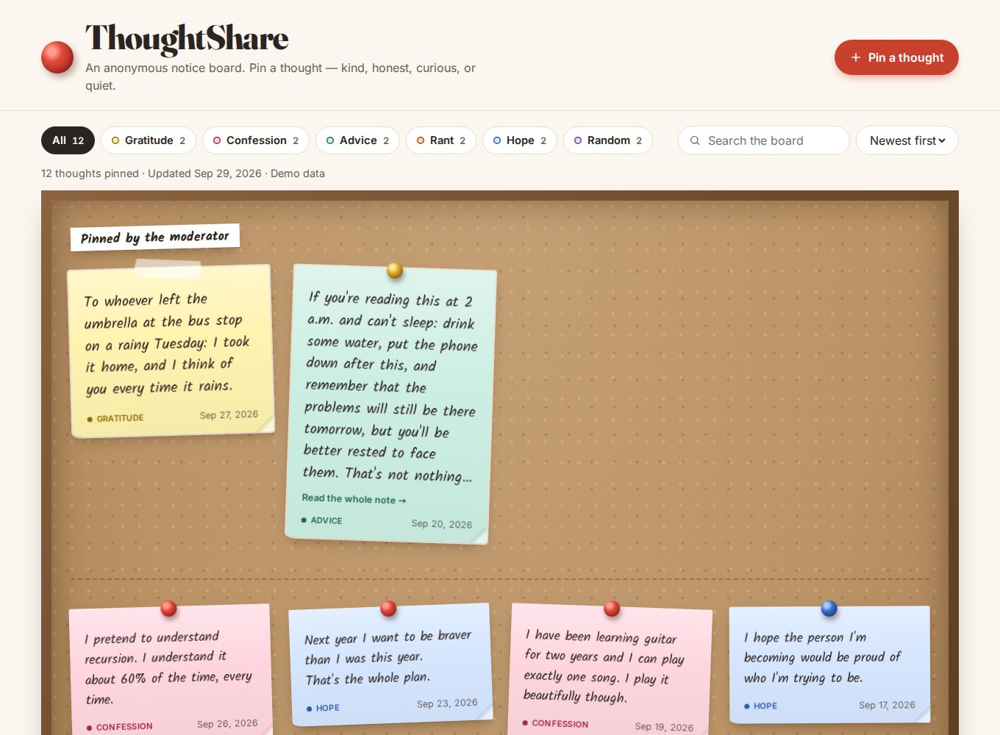

# ThoughtShare

**An anonymous notice board you can run for free on GitHub Pages.**
Visitors pin a thought without logging in. Every note goes to *your* private Google Sheet first. Nothing appears on the board until you approve it.
You can answer notes as the moderator, and visitors can reply anonymously, so each note can become a conversation. Replies are reviewed too.



**Live board:** https://tashreefmuhammad.github.io/ThoughtShare/
**Preview with sample notes:** add `?demo` to the address, for example `https://tashreefmuhammad.github.io/ThoughtShare/?demo`

---

## Contents

1. [How it works](#how-it-works)
2. [What's in the repo](#whats-in-the-repo)
3. [Make your own board (about 15 minutes)](#make-your-own-board-about-15-minutes)
4. [Daily moderation](#daily-moderation)
5. [Optional: one-click publishing](#optional-one-click-publishing-no-copy-paste)
6. [Customising](#customising)
7. [The messages.json format](#the-messagesjson-format)
8. [Privacy and safety](#privacy-and-safety)
9. [Troubleshooting](#troubleshooting)
10. [FAQ](#faq)

---

## How it works

```
Visitor writes a note ──► Google Apps Script ──► Your private Google Sheet
                                                  (only you can open it)
                                                          │
                                         you read it, tick "Approved",
                                         pick a category, maybe "Featured"
                                                          │
                            export approved notes → data/messages.json → push
                                                          │
Visitors ◄──── GitHub Pages rebuilds the board from messages.json (≈1 minute)
```

- **GitHub Pages** hosts the board. It's a static site, so it can show notes but can't receive them.
- **Google Apps Script**, attached to a Google Sheet, is the free "inbox". The website sends each note there.
- **Only approved notes** ever reach the public repository. Pending and rejected notes stay in your sheet, so they never appear in the git history either.
- **Threads:** clicking a note opens it with its replies. Visitors reply anonymously; replies land in a separate **Replies** tab and need your approval just like notes. Your own replies are labelled *Moderator*.

## What's in the repo

| Path | What it is | Do you edit it? |
|---|---|---|
| `config.js` | Board title, tagline, form URL, categories and colours | **Yes. This is the only required edit.** |
| `data/messages.json` | The approved notes shown on the board | Yes, each time you publish (or let the Action do it) |
| `apps-script/Code.gs` | The backend. Paste it into Google Apps Script | Only to change categories or limits |
| `index.html`, `assets/` | The board itself | Only if you want to redesign |
| `data/messages.example.json` | Sample notes used by `?demo` | Optional |
| `.github/workflows/pages.yml` | Validates the data and deploys the site. Can also sync from your sheet | No |
| `scripts/` | Small Node scripts used by the workflow | No |

There's no build step, framework or npm install. It's plain HTML, CSS and JavaScript.

---

## Make your own board (about 15 minutes)

You need a GitHub account and a Google account.

### Step 1 — Fork the repository

1. Click **Fork** (top right of this page).
2. Keep the name `ThoughtShare`, or rename it. The name becomes part of your URL: `https://<your-username>.github.io/<repo-name>/`.

### Step 2 — Turn on GitHub Pages and Actions

1. In **your fork**, open the **Actions** tab. GitHub disables Actions on forks by default, so click **"I understand my workflows, go ahead and enable them"**.
2. Go to **Settings → Pages**. Under **Build and deployment → Source**, choose **GitHub Actions**.
3. Go to **Actions → Publish ThoughtShare → Run workflow** once. You can leave the sync box ticked; without secrets it just skips that step.

After about a minute, your board is live at `https://<your-username>.github.io/<repo-name>/`. It will be empty, and the form will say submissions aren't open yet. That's expected.

### Step 3 — Create your private Google Sheet

1. Go to [sheets.new](https://sheets.new) to create a blank sheet. Name it something like *ThoughtShare Inbox*.
2. In the sheet, open **Extensions → Apps Script**.
3. Delete everything in the editor. Paste the full contents of [`apps-script/Code.gs`](apps-script/Code.gs), then click **Save**.
4. Optional but recommended: in Apps Script, open **Project Settings** (gear icon) and set **Time zone** to yours, for example `Asia/Dhaka`. Dates on the board use this time zone.
5. Go back to the sheet tab and **reload the page**. A **ThoughtShare** menu appears after a few seconds.
6. Click **ThoughtShare → Set up / repair sheet**. Google asks you to authorise the script:
   - Choose your account.
   - If you see "Google hasn't verified this app", click **Advanced → Go to (project name)**. This is your own script, so it's safe.
   - Click **Allow**.
7. The sheet now has a formatted **Submissions** tab with checkboxes and a category dropdown, and a **Replies** tab for thread replies.

### Step 4 — Publish the script as a web app

1. In the Apps Script editor, click **Deploy → New deployment**.
2. Click the gear next to "Select type" and choose **Web app**.
3. Set:
   - **Description:** `ThoughtShare`
   - **Execute as:** **Me**
   - **Who has access:** **Anyone**. This lets visitors submit without a Google login. They still can't read anything.
4. Click **Deploy** and copy the **Web app URL**. It ends in `/exec`.

> **Changed `Code.gs` later?** Use **Deploy → Manage deployments → ✏️ Edit → Version: New version → Deploy**. This keeps the same URL. Creating a *new* deployment gives you a different URL, and you would then need to update `config.js`.

### Step 5 — Connect the board to your sheet

In your fork, open `config.js` (click the file, then the ✏️ pencil) and change:

```js
siteTitle: "ThoughtShare",
tagline: "An anonymous notice board. …",
ownerName: "Your Name",
ownerUrl: "https://github.com/your-username",
submitEndpoint: "https://script.google.com/macros/s/XXXXXXXX/exec",   // ← paste your URL
```

Commit the change. The workflow redeploys automatically. After about a minute, open your board and send a test note. It should appear as a new row in your sheet.

**You're done.** The next section covers moderating and publishing.

---

## Daily moderation

### Notes — the **Submissions** tab

| ID | Received | Message | Suggested category | Category (final) | Approved | Featured | Private notes | My reply |
|---|---|---|---|---|---|---|---|---|

1. Read the message.
2. Leave **Category (final)** blank to accept the visitor's suggestion, or pick a different one. Notes with no category go to your default category (`random`).
3. Tick **Approved** to publish it. Tick **Featured** to pin it at the top of the board under *Pinned by the moderator*.
4. To answer it, type in **My reply**. The answer shows on the note's card and at the top of its thread, labelled *Moderator*.
5. Rejecting a note needs no action. Leave it unticked, or delete the row.
6. To unpublish later, untick **Approved** and publish again. Its replies disappear with it.

Approved rows turn green and featured rows turn gold, so you can see your decisions at a glance.

### Thread replies — the **Replies** tab

| ID | Received | Thread ID | Message | From me | Approved | Private notes | Replying to |
|---|---|---|---|---|---|---|---|

- Visitor replies arrive here. **Replying to** shows the note they belong to, so you have context.
- Tick **Approved** to publish a reply.
- **To post your own message in a thread**, use the first empty row: paste the note's ID into **Thread ID**, type your **Message**, and tick **From me**. The ID and time fill in by themselves. Your own messages don't need approving.
- Visitors can only reply to approved notes. Replies to hidden or made-up IDs are refused.
- Thread messages appear oldest first. Visitors can link straight to a thread (the address ends in `#t=<note-id>`).

### Publishing (manual way)

1. **ThoughtShare → Export approved as JSON.**
2. Click **Copy** (or **Download file**).
3. On GitHub, open `data/messages.json` → ✏️ → select all → paste → **Commit changes**.
4. After about a minute, the board updates.

If the pasted JSON is broken, the deploy stops and your live board keeps its last good version. The **Actions** tab shows what was wrong.

---

## Optional: one-click publishing (no copy-paste)

The workflow can fetch approved notes directly from your sheet, commit them, and redeploy.

1. In the sheet: **ThoughtShare → Show sync key** and copy the key.
2. In your repo: **Settings → Secrets and variables → Actions → New repository secret**. Add two secrets:
   - `THOUGHTSHARE_ENDPOINT`: your web app URL (the `/exec` one)
   - `THOUGHTSHARE_EXPORT_KEY`: the sync key
3. To publish from then on: **Actions → Publish ThoughtShare → Run workflow → Run**.

To make it fully automatic, open `.github/workflows/pages.yml` and uncomment the `schedule` block. It then syncs every 6 hours.

**Is the sync key safe?** The key only unlocks the *approved* list, which is public on your board anyway. Pending notes are never sent anywhere. If the key leaks, use **ThoughtShare → Create a new sync key** and update the secret.

---

## Customising

### Categories and colours

Edit `categories` in `config.js`:

```js
{ id: "gratitude", label: "Gratitude", color: "#FFF3B0", ink: "#8A6D00" },
```

- `id` is what's stored in the sheet and JSON. Use lowercase with no spaces.
- `label` is what visitors see.
- `color` is the sticky-note paper colour. `ink` is the colour of the note's tag and its chip. Keep `ink` dark enough to read on `color`.

Then **update the same ids** in `CATEGORIES` at the top of `Code.gs`, save, run **ThoughtShare → Set up / repair sheet** to refresh the dropdown, and redeploy a new version (see Step 4).

Only categories that have at least one note show up as filter chips on the board.

### Other settings

| Setting | Where | Default |
|---|---|---|
| Max note length | `maxLength` in `config.js` **and** `MAX_LENGTH` in `Code.gs` | 600 |
| Allow visitor replies | `allowReplies` in `config.js` **and** `ALLOW_REPLIES` in `Code.gs` | on |
| Max reply length | `replyMaxLength` in `config.js` **and** `REPLY_MAX_LENGTH` in `Code.gs` | 400 |
| Label on your replies | `moderatorLabel` in `config.js` | Moderator |
| Wait between submissions (per browser) | `cooldownSeconds` in `config.js` | 60 s |
| Notes per page before "Show more" | `pageSize` in `config.js` | 24 |
| Board-wide flood limit | `MAX_PER_10_MIN` in `Code.gs` | 40 per 10 min |
| Show dates on notes | `INCLUDE_DATES` in `Code.gs` | on (day only, no time) |

### Look and feel

All colours, fonts and sizes are CSS variables at the top of `assets/css/style.css`. The board is intentionally light-only, like a real corkboard.

### Custom domain

Add it under **Settings → Pages → Custom domain**. All paths in the site are relative, so nothing else needs to change.

---

## The messages.json format

```json
{
  "updated": "2026-09-30",
  "messages": [
    {
      "id": "t-260929-0ad8b",
      "text": "The note itself. Line breaks are kept.",
      "category": "gratitude",
      "date": "2026-09-29",
      "featured": false,
      "reply": "Your answer as the moderator (optional).",
      "replies": [
        { "id": "r-260930-1a2b3", "text": "An anonymous reply.", "date": "2026-09-30", "fromOwner": false },
        { "id": "r-260930-4c5d6", "text": "Your follow-up in the thread.", "date": "2026-09-30", "fromOwner": true }
      ]
    }
  ]
}
```

- Required: `text`. Recommended: `id` (must be unique), `category`, `date` (`YYYY-MM-DD`), and `featured` (`true`/`false`).
- Optional: `reply` (your answer) and `replies` (the thread; each needs `text`).
- An unknown category falls back to `defaultCategory`.
- Files from older versions, without `reply`/`replies`, still work unchanged.
- You can write the file by hand. The export just saves you the typing.

---

## Privacy and safety

**What is stored:** the note or reply, the time it arrived, the category the visitor picked, and (for replies) which note it answers. That's all.

**What is not stored:** names, emails, IP addresses, cookies or device information. Apps Script doesn't pass the visitor's identity or IP to your script, so the sheet can't contain it.

**Honest limits:**
- Google (running the script) and GitHub (hosting the page) keep their own server logs like any website, and the page loads fonts from Google Fonts. "Anonymous" here means anonymous **to you and to other visitors**, not invisible to infrastructure providers.
- People can still identify themselves in what they write. The form reminds them not to, and you're the final filter.

**Built-in protections:**
- Every note and reply is shown with `textContent`, never as HTML. A note containing `<script>` just displays as text. The `?demo` data includes a note that tests this.
- Text starting with `=`, `+`, `-` or `@` is stored as plain text, so a note can't become a live formula in your sheet.
- There's a hidden "honeypot" field and a minimum time on the page, which catch simple bots.
- The script limits total submissions (notes and replies together) per 10 minutes and ignores repeats of the same text for 6 hours.
- The browser enforces a short cooldown between a visitor's submissions.

**If you get spammed:** lower `MAX_PER_10_MIN`, or put the form behind [Cloudflare Turnstile](https://developers.cloudflare.com/turnstile/), a free CAPTCHA that doesn't track people. That requires a small change to `Code.gs` to verify the token.

---

## Troubleshooting

| Symptom | Fix |
|---|---|
| Form says "Submissions aren't open yet" | `submitEndpoint` in `config.js` is empty, or doesn't start with `https://`. |
| "Couldn't reach the board" on submit | The web app isn't deployed with **Who has access: Anyone**, or the URL is wrong. Opening the URL in a browser should show `{"ok":true,"service":"ThoughtShare"...}`. |
| Error mentioning "Set up / repair sheet" | Run **ThoughtShare → Set up / repair sheet** once. Don't rename the **Submissions** tab. |
| No **ThoughtShare** menu in the sheet | Reload the sheet and wait a few seconds. The script must be created from *inside* the sheet (Extensions → Apps Script). |
| I edited `Code.gs` but nothing changed | Redeploy a **new version** (Deploy → Manage deployments → Edit → New version). |
| Board shows "couldn't be loaded" | `data/messages.json` is invalid. Check the latest run in the **Actions** tab. |
| The workflow fails at "deploy" | Settings → Pages → Source must be **GitHub Actions**, not "Deploy from a branch". |
| Board didn't update after a push | Wait 1–2 minutes and hard-refresh. The page fetches the JSON with `no-cache`, but the CDN can take a moment. |
| Reply form says "This thread isn't open for replies" | The note isn't ticked **Approved** in the sheet (or was unapproved after the board was published). |
| No **Replies** tab | You're on an older `Code.gs`. Paste the latest one, run **Set up / repair sheet**, and deploy a new version. |
| Sync step says "refused" | The sync key changed. Copy it again with **Show sync key** and update the secret. |

---

## FAQ

**Is it really free?** Yes. GitHub Pages, GitHub Actions for public repos, Google Sheets and Apps Script are all free at this scale.

**Can visitors see pending notes?** No. The public web app only accepts new notes and replies. Reading requires the sync key, and even that returns only approved content.

**Can I tell if a reply is from the person who wrote the note?** No. Everyone in a thread is anonymous; only your own messages are marked.

**I set up an older version. Will updating break my sheet?** No. Paste the new `Code.gs`, run **Set up / repair sheet**, and deploy a new version. Setup only adds the **My reply** column and the **Replies** tab. It never removes rows or changes your ticks.

**Can I moderate from my phone?** Yes. Use the Google Sheets app to tick boxes. To publish, run the workflow from the GitHub mobile app or github.com.

**Can I use Formspree, a database, or something else instead of Google Sheets?** Yes. The board only needs `submitEndpoint` to accept a form-encoded POST with `message` and `category` fields and return `{"ok": true}`.

---

## License

[MIT](LICENSE). Fork it, change it, run your own board. A link back is appreciated but not required.
